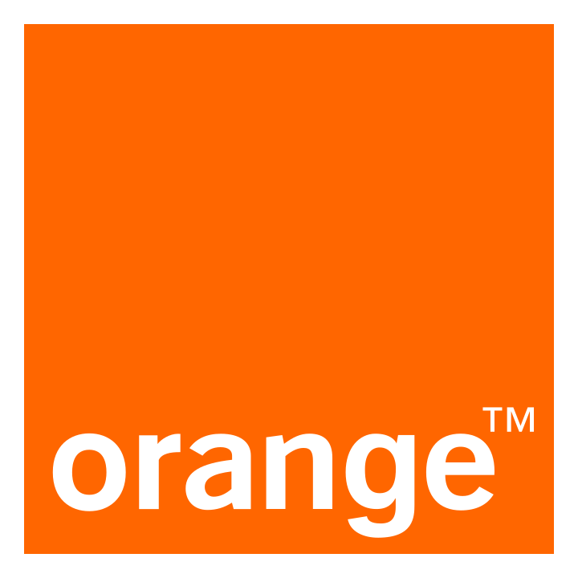
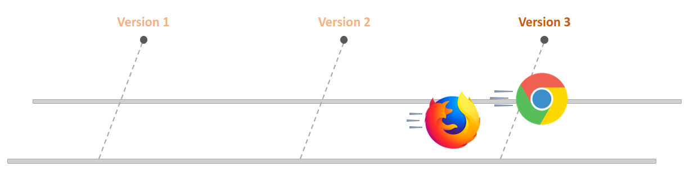
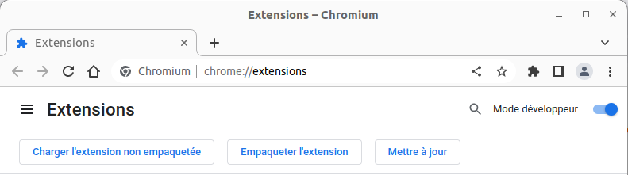

<!-- .slide: data-background="#FFF" class="cover" -->

# Développez votre première extension de naigateur<!-- .element: class="title" -->

## Breizhcamp 2023 <!-- .element: class="title" -->

Aurélien Partiot, Florent Vuillemin <!-- .element: class="author" -->

28/06/2023 <!-- .element: class="date" -->



--

# Aurélien Partiot
## Développeur IA


* 
* 
* 

-- 

# Florent Vuillemin
## Développeur d'outils de sécurité


C, Go, Kotlin, Elm (de l'ATmea168 à Openshift)

Traque les sites de phishing à ses heures perdues

<a href="https://mamot.fr/@fvln">
	 @fvln@mamot.fr
</a>

---

<!-- .slide: class="plan" data-background="./images/paper-board_o10.png" -->

# Plan

1. Introduction et mise en place
2. Le content-script
3. Menu contextuel
4. Background script
5. Browser action (icône)

---
<!-- .slide: data-background="#000" class="chapter" -->

# Introduction <!-- .element: class="r-fit-text" -->

--

## Historique des navigateurs

1. 1990: **WorldWideWeb** - Premier navigateur
2. 1993: **NCSA Mosaic** - Premier navigateur à afficher des images (GIF et XBM)
3. 1995: Création d'**Internet Exploreur**
4. 2000:	**IE** gagne la guerre des navigateurs 😒
5. 2003: Création de **Mozilla Firefox**
6. 2005: **IE** ⏬ vs **Firefox** ⏫
7. 2008: Sortie de **Google Chrome**
8. 2012: **Chrome** devient le navigateur le plus utilisé

--

## Développement des extensions

1. 2010: Ouverture du **Chrome Web Store**
2. 2012: Plus de **750 millions** d'extension sur CWS
3. 2017: Les extensions **Firefox** sont désormais largement compatibles avec celles de Chrome
4. 2020: Microsoft reconstruit **Edge** avec Chromium
5. 2020: Apple sort **Safari 14** qui copie l'API de chrome pour les extensions.

--

## Manifests - la guerre des versions



--

## Manifests - v2 vs v3

|Feature			 | v2			| v3			|
|--------------|---------------|---------------|
|line 1 cell 1 | line 1 cell 2 | line 1 cell 3 |

--

# `manifest.json`- la base

```json [2-4|5-9|11-16]
{
	"manifest_version": 2,
	"name": "Borderify",
	"version": "1.0",
	"description": "Adds a solid red border to all webpages matching mozilla.org.",
	"homepage_url": "https://github.com/mdn/webextensions-examples/tree/master/borderify",
	"icons": {
		"48": "icons/border-48.png"
	},

	"content_scripts": [
		{
			"matches": ["*://*.mozilla.org/*"],
			"js": ["borderify.js"]
		}
	]
}
```

--

## Et sur mobile ?

TODO

---
<!-- .slide: data-background="#000" class="chapter" -->

# Let's get started! <!-- .element: class="r-fit-text" -->

--

# Pré-requis

## NodeJS

➡️ https://nodejs.org/en/download

* Windows - MSI ou ZIP
* MacOS
* Linux
* Docker

## Git

Selon votre système d'exploitation

--

# Premier test

## Récupérer les sources de la formation

```sh
git clone https://github.com/Nuuky/breizhcamp-2023-webextension.git
cd breizhcamp-2023-webextension/0-template
```

## Installer les packages node

```sh
npm install
```

* `parcel` : build/serve HTML/CSS/JS
* `web-ext` : un outil en ligne de commande pour developper des extensions
* `eslint` : un linter JS 

--

## Lancer le build pour Chrome

```sh
# Assembler l'extension dans dist/
npm run build

# Idem avec mise à jour automatique
npm run watch
```


* Charger l'extension non empaquetée
* Sélectionner le dossier `dist/`

--

## Lancer le build pour Firefox

```sh
# Assembler l'extension dans dist/
npm run build:firefox

# Idem avec mise à jour automatique
npm run watch:firefox

# Lance un navigateur déjà outillé
npm run dev:firefox
```

Quelques subtilités :
* Parcel ne gère par le build d'extensions au format MV3 pour Firefox
* Besoin de modifier à la marge le `manifest.json` au moment du build

-- 

# ça marche ?

Alors c'est l'occasion de customiser votre `manifest.json` !

---

<!-- .slide: data-background="#000" class="chapter" -->

# Le content-script <!-- .element: class="r-fit-text" -->

--

## Le content-script

> Un script de contenu (content script en anglais) est une partie de votre extension qui s’exécute dans le contexte d’une page web donnée

* Ce script a accès à tout le DOM, il est idéalement placé pour observer son contenu ou le modifier.

* Il ne voit pas les variables définies par le javascript de la page, ni les bibliothèques chargées (jQuery...).
	* Améliore la sécurité (introduit dès le début de Chrome)
	* Limite les conflits !

* Limitations : 
	* ⛔ le content-script est désactivé sur les domaines sensibles comme https://accounts.firefox.com
	* Il ne permet pas d'accéder à toute l'API WebExtension

-- 

## Le content-script

* Documentation : [  Chrome](https://developer.chrome.com/docs/extensions/mv3/content_scripts/), [  Firefox](https://developer.mozilla.org/fr/docs/Mozilla/Add-ons/WebExtensions/Content_scripts)
* Déclaration dans le manifest :
```json
{
	"content_scripts": 
	[{
		"matches": ["<all_urls>"],
		"js": ["content-script/index.js"]
	}],
}
```

* Permet d'injecter du JS, du CSS
* Sur des sites/pages précises
* Déclaration possible au runtime (demande de permissions à la volée*)

*ou pas (voir [activeTab](https://developer.chrome.com/docs/extensions/mv3/manifest/activeTab/))


-- 

# Le content-script

## Votre premier choix

| DinoFacts | PoliDino |
|-|-|
| Ajouter des anecdotes amusantes concernant les dinosaures sur chaque page |  Remplacer les noms des personnes politiques par des noms de dinosaures, une idée inspirée de  [Proutify](https://addons.mozilla.org/fr/firefox/addon/proutify/) |
| Injection de CSS | Remplacement sur le domaine liberation.fr |

--

## Procédure

```json
{
	"content_scripts": [
		{
			"matches": ["<all_urls>"],
			"js": ["content-script/index.js"],
			"css": ["content-script/index.css"],

		}
	],
}
```

### Déploiement

|| Chrome | Firefox |
|-|-|-|
| Initialisation | npm run watch | npm run watch:firefox |
| Lancement du navigateur | lancer chrome, installer l'extension | npm run dev:firefox |
| Après modif du code | Recharger l'extension | Rechargement automatique |


---

---


You can format text to *italic* and **bold** emphasis.

> You can also quote someone.
>
> Lao Tseu

[Linking](http://www.example.com) is very easy !

Orange brand colors :

- **blue font** <!-- .element: class="blue" --> or **blue background** <!-- .element: class="bgblue" -->
- **yellow font** <!-- .element: class="yellow" --> or **yellow background** <!-- .element: class="bgyellow" -->
- **green font** <!-- .element: class="green" --> or **green background** <!-- .element: class="bggreen" -->
- **purple font** <!-- .element: class="purple" --> or **purple background** <!-- .element: class="bgpurple" -->
- **pink font** <!-- .element: class="pink" --> or **pink background** <!-- .element: class="bgpink" -->

--

### example of a table

Lorem ipsum dolor sit amet, consectetur adipiscing elit. Duis ac nisl nec lectus consequat laoreet a nec urna. Aenean
turpis odio, aliquet vitae ante non, varius rutrum massa. Etiam faucibus laoreet ligula et porttitor. Donec et lorem
sapien. Nam mattis est ligula. Quisque faucibus lorem et fringilla pretium. Proin lacinia diam id magna imperdiet,
feugiat iaculis est luctus. Mauris et sodales ipsum.

|header 1			| header 2			| header 3			| header 4			|
|--------------|---------------|---------------|---------------|
|line 1 cell 1 | line 1 cell 2 | line 1 cell 3 | line 1 cell 4 |
|line 2 cell 1 | line 2 cell 2 <!-- .element: class="bggreen" --> | line 2 cell 3 | line 2 cell 4 |
|line 3 cell 1 | line 3 cell 2 | line 3 cell 3 | line 3 cell 4 <!-- .element: class="bgpurple" --> |
|line 4 cell 1 <!-- .element: class="bgblue" --> | line 4 cell 2 | line 4 cell 3 | line 4 cell 4 |

--

# linking slideshows

You can link between slides internally, [like this](#/1/1).

Or an external link: [orange](http://www.orange.fr).

---
<!-- .slide: data-background="#000" class="chapter" -->

# rich content

--

# code snippets

You can add some code snippets in your presentation.

```java
// call ajax to web elipi
$.ajax({type:"GET",
				url:"https://web-elipi.orange.fr/api/v1/address",
				data:{q:adresse},
				beforeSend:function(req){
				req.setRequestHeader("token","FgR8...DvG6");
				}
				})
				.done(function(data,textStatus,jqXHR){
				var response=[...];
				$('#responseWebElipi').text(response);
				})
				.fail(function(err){
				var error=[...];
				$('#responseWebElipi').text(error);
				});
```

It is automatically highlighted!

--

# lists

## ordered and unordered

- list item
		- sublist item
		- sublist item
- another list item
		1. sublist item
		1. sublist item

--

# images

This image is embedded in the markdown
file : ![couch](data:image/png;base64,iVBORw0KGgoAAAANSUhEUgAAAEgAAABSCAYAAAD3oJK6AAAAGXRFWHRTb2Z0d2FyZQBBZG9iZSBJbWFnZVJlYWR5ccllPAAAAyJpVFh0WE1MOmNvbS5hZG9iZS54bXAAAAAAADw/eHBhY2tldCBiZWdpbj0i77u/IiBpZD0iVzVNME1wQ2VoaUh6cmVTek5UY3prYzlkIj8+IDx4OnhtcG1ldGEgeG1sbnM6eD0iYWRvYmU6bnM6bWV0YS8iIHg6eG1wdGs9IkFkb2JlIFhNUCBDb3JlIDUuMy1jMDExIDY2LjE0NTY2MSwgMjAxMi8wMi8wNi0xNDo1NjoyNyAgICAgICAgIj4gPHJkZjpSREYgeG1sbnM6cmRmPSJodHRwOi8vd3d3LnczLm9yZy8xOTk5LzAyLzIyLXJkZi1zeW50YXgtbnMjIj4gPHJkZjpEZXNjcmlwdGlvbiByZGY6YWJvdXQ9IiIgeG1sbnM6eG1wPSJodHRwOi8vbnMuYWRvYmUuY29tL3hhcC8xLjAvIiB4bWxuczp4bXBNTT0iaHR0cDovL25zLmFkb2JlLmNvbS94YXAvMS4wL21tLyIgeG1sbnM6c3RSZWY9Imh0dHA6Ly9ucy5hZG9iZS5jb20veGFwLzEuMC9zVHlwZS9SZXNvdXJjZVJlZiMiIHhtcDpDcmVhdG9yVG9vbD0iQWRvYmUgUGhvdG9zaG9wIENTNiAoV2luZG93cykiIHhtcE1NOkluc3RhbmNlSUQ9InhtcC5paWQ6QTU2MTE2RjZFMjc2MTFFM0FERTk5ODQ2QjMwOEE1MkMiIHhtcE1NOkRvY3VtZW50SUQ9InhtcC5kaWQ6QTU2MTE2RjdFMjc2MTFFM0FERTk5ODQ2QjMwOEE1MkMiPiA8eG1wTU06RGVyaXZlZEZyb20gc3RSZWY6aW5zdGFuY2VJRD0ieG1wLmlpZDpBNTYxMTZGNEUyNzYxMUUzQURFOTk4NDZCMzA4QTUyQyIgc3RSZWY6ZG9jdW1lbnRJRD0ieG1wLmRpZDpBNTYxMTZGNUUyNzYxMUUzQURFOTk4NDZCMzA4QTUyQyIvPiA8L3JkZjpEZXNjcmlwdGlvbj4gPC9yZGY6UkRGPiA8L3g6eG1wbWV0YT4gPD94cGFja2V0IGVuZD0iciI/PmVFDLkAAAXqSURBVHja7Jv7bxRVFMdnl2230FVKC4pWFGykCVBFfCRUxVeV+EiUEHzFxIjRn4yPHzQaJP5Kon+AGh8xGjSN6A++imKsj2gi+EoVUhGLglRtq31tu2t3u34PfG9zuNltkzpT0/Wc5BOmM3PvzP3ec889984SKxQKgVlpi5sEJpAJZAKZQCaQCWQCmUBmJpAJZAKZQCaQCWQCmUBmJpAJZALNkMUKjx7/N6gASTA0jfrmgflgEVgFVoPloAGcBmp4n3wp6Ad/gsNgF3gZHOT1peB20MJytSwb4/V+ljsAfgDfgO9ADxgAI9N49xNAFozx/SYEirMhV4KT1Qu9D56YolIRs55cCC4nKXWPPHAQpMEoyKlOEE6ksIfA9SzzFljChg7yxd3LJ8BcUM2yFepZw+BD8gX4lYxN0Y6HwFWgj/f/Dj4Q4UUgedAbvMG3S8Cn3jl5qRWgCVwGrgEL1HVp6H7wC+jk8c+gG/SyodX0NOEMcAe4BXSxjmXgVfAiyw6QNEVdCE5h2bNAIzidx0vUu/wF3gXtoAPspeDaLgafFGm7OMgG6Y08KxJ7HuwAN4B7wDZWIB6xDlxAD7lUVSTD5G26+FfgWwozmaXJEbAPtDEe3sTrreDWEmWzyjP2eNdEqHPAGg7xteA2IvYRvWs3+Jget43XngJvgo1gMzXJi0AZ1XNS+B2610XkJXAmaFYv8j3YCb5kz3SEEA+3KIG2TLOOTtLKv5vIeWA9O9Z17mfgJ7ZROvd+8DfDy2bGw0yCNzuBzla9JG65ksEyoOry4K/pqt0hTxg/0jvdcRjmOm87eJKh4Vx2RLPq9HaKozU4+g4JFTcCzj7OngZ3MqJvYtDri3hWbY+w7m4io+MFhovXODM+o+5zGhzWeZBreI2nvsSUSqobtTgzaX2cISs4InSIqFGxdUKgjLpYqW5uYyU3l2EOuIlt3aXOVSqBMlqgLIdSLadxZ67wGpWklYud77XRpTC11CKrBRplnlHDjNLZPl5b7OUXs90WMY8a44yss+kaajGqBXLZbjWz1EAJt4eJ2aoyEkim/jrmbGl13mXogy77dgLlKUbSS93zVDjJXKhcbCmT371so146JalFXgs0zjGX9IL0OJOpgGu0crF6/nvQE6iSGmTZ9ok8KKemvQqvsh41PgMmWms59Y+H9MJz1PonUOvCfIjbOtL4zzmtz+f5P4osviuoRU4LlFdTfdIrNOLtHT0miziWCfMHjjEuTAMuQsOuew4X5RuLtC3w2p5xnZPwKnDeVMxc4e0MYpkQPSjLwNmipt6OIp31bzyoitsoui3+aMkpj45pgRKM3uNqTeKsTmeWXO3viCAuNCuBHudiMipLF1k5BCpsVDtt4sqDEpzacp5rLufxgYgDZ6bEcRTWqYZy3PMgtyl3nAeJ+53E/ZFRVaCK2wRiN7LCVAQvPMS9nEDFuU4vaQ3Te5p4fAXbOKLyvmFqUaUFSnG7VfZ3+73ZZSGPryYzYRtm6Dl1ngdJ23s5alJaoHl0qW41rbsofx04NcQpdzKrVLEgapPOP+LNZD3UoJGaTAi0mP/6G9zj3Cj7v9gYNZjQJK6SP7GuwKxLaxLnAu1aDqHdps9RDfLUZK4I1MAcpMPbGymVkZaDxSZpj0tSRZMGiUFb1VL/Xq5TYt4mUo6kGOnzIYsVY/1uxuxlfCxE8IwUp3C3/5V2m2N83oDa8tkqHw6HIsptysGGE8w5GotM4wVeW8+lhXwpfZAu2KrWbmFYgT2sp/lCyF5aYDsf4Ez1HLiPnvpIkXWltK/T//GCb21cH61kBZJIPgvunqUeIZ+3XwmO/ebg4eDYty9JFhdMtsotZfIJdx2VfB28x/OrVayYTSbLlrt4LJ+i5avwMsajllKFEpNUKB5ziAnTCp6TbY79wfR+GvNfW5bBf5BrrXquu2S4/VYystt/6p16I8nMBDKBTCATyAQygUwgE8jMBDKBTCATyAQygUwgE8jMBDKBTCATyAQygUwgE8gEMjOBTKDo7B8BBgBqVGc4hv8P4wAAAABJRU5ErkJggg%3D%3D)

This is a real png image: 

--
<!-- .slide: data-background="./images/mission_o10.png" -->

# background image

You can add a background image by adding that string:

```html
<!-- .slide: data-background="images.png" -->
```

---
<!-- .slide: data-background="#000" class="chapter" -->

# advanced features

examples...

--

# fragments

Hit the next arrow...

... to step through ... <!-- .element: class="fragment" data-fragment-index="1" -->

... a fragmented slide. <!-- .element: class="fragment" data-fragment-index="2" -->

--

# fragments styles

<div style="text-align:center">

There's different types of fragments, like:	

grow <!-- .element: class="fragment grow" -->	

shrink <!-- .element: class="fragment shrink" -->	

roll-in <!-- .element: class="fragment roll-in" -->	

fade-out <!-- .element: class="fragment fade-out" -->

<p>
		<span style="display: inline-block;" class="fragment fade-right">fade-right, </span>
		<span style="display: inline-block;" class="fragment fade-up">up, </span>
		<span style="display: inline-block;" class="fragment fade-down">down, </span>
		<span style="display: inline-block;" class="fragment fade-left">left</span>
</p>

<p class="fragment fade-in-then-out">fade-in-then-out</p>
<p class="fragment fade-in-then-semi-out">fade-in-then-semi-out</p>

<p>
Highlight : <!-- .element: style="display: inline-block;" -->	 

red <!-- .element: class="fragment highlight-red" style="display: inline-block;" -->		

blue <!-- .element: class="fragment highlight-blue" style="display: inline-block;" -->		 

green <!-- .element: class="fragment highlight-green" style="display: inline-block;" -->	

</p>


</div>


--

# speaker view and notes

Press the S key to try it out.

Note:
Oh hey, these are some notes. They'll be hidden in your presentation, but you can see them if you open the speaker notes
window (hit 's' on your keyboard).

- note 1
		- item A
		- item B
- note 2
		- item C
		- item D

---
<!-- .slide: data-background="#000" class="chapter" -->

# extensions

--

# Fontawesome

[solid icons](https://fontawesome.com/search?s=solid)

- <i class="fa-solid fa-user fa-2xl"></i>

- <i class="fa-solid fa-address-card fa-2xl"></i>

- <i class="fa-solid fa-computer fa-2xl"></i>

- <i class="fa-solid fa-laptop fa-2xl"></i>

--

# Boosted layout

<div class="container">
<div class="row">

<div class="col">

### marvelous list

<ul>
	<li>No order here</li>
	<li>Or here</li>
	<li>Or here</li>
	<li>Or here</li>
</ul>

</div>

<div class="col">

### code snippets

You can add some code snippets in your presentation.

```java
// call ajax to web elipi
$.ajax({type:"GET",
				url:"https://web-elipi.orange.fr/api/v1/address",
				data:{q:adresse},
				beforeSend:function(req){
				req.setRequestHeader("token","FgR8...DvG6");
				}
				})
				.done(function(data,textStatus,jqXHR){
				var response=[...];
				$('#responseWebElipi').text(response);
				})
				.fail(function(err){
				var error=[...];
				$('#responseWebElipi').text(error);
				});
```

</div>

</div>
</div>

--

# Boosted component

### text badges

example <span class="badge bg-secondary">New</span>

### pill badges

<span class="badge rounded-pill bg-primary">Primary</span>
<span class="badge rounded-pill bg-secondary">Secondary</span>
<span class="badge rounded-pill bg-success">Success</span>
<span class="badge rounded-pill bg-danger">Danger</span>
<span class="badge rounded-pill bg-warning">Warning</span>
<span class="badge rounded-pill bg-info">Info</span>
<span class="badge rounded-pill bg-light">Light</span>
<span class="badge rounded-pill bg-dark">Dark</span>

---
<!-- .slide: data-background="#000" class="chapter" -->

# about

--

# credits

This Orange theme for [reveal](http://lab.hakim.se/reveal-js/) has been created by:

- Julien Ciais
- Benoît Bailleux

The mardkown version of the boilerplate has been published by:

- Romain Du Chaffaut

--

# using the boilerplate

This **reveal Orange boilerplate** is available :

- as a [GitLab project](https://gitlab.tech.orange/ethertools/reveal-orange-boilerplate)
- as a [demo website](https://ethertools.pages.gitlab.tech.orange/reveal-orange-boilerplate/)

If you want to contribute and to improve this boilerplate, you can fork the git repository and open a merge request.

With this **reveal Orange boilerplate**, you can write your
presentation [in html](https://ethertools.pages.gitlab.tech.orange/reveal-orange-boilerplate/)
or [in markdown](https://ethertools.pages.gitlab.tech.orange/reveal-orange-boilerplate/markdown.html).

There is also a [remark](https://ethertools.pages.gitlab.tech.orange/remark-orange-boilerplate/#9) alternative that
allow you to type your presentation in markdown.

---
<!-- .slide: data-background="#000" class="chapter" -->

# thank you

Any question?

---
<!-- .slide: data-background="#000" class="chapter" -->

# annexes

--

# annex 1

Documents that do not really belong in the presentation can be placed in the annex.

--

# annex 2

Documents that do not really belong in the presentation can be placed in the annex.

As many as necessary.
