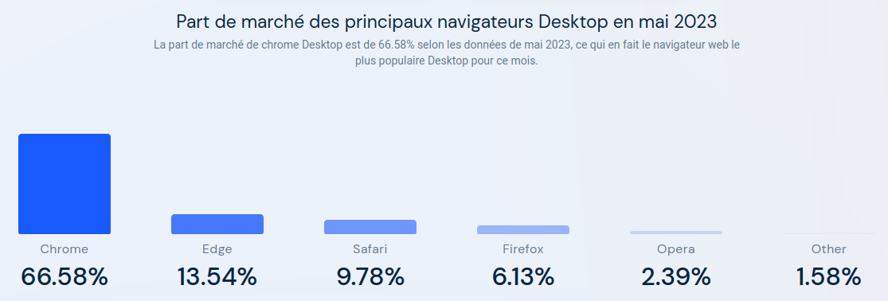
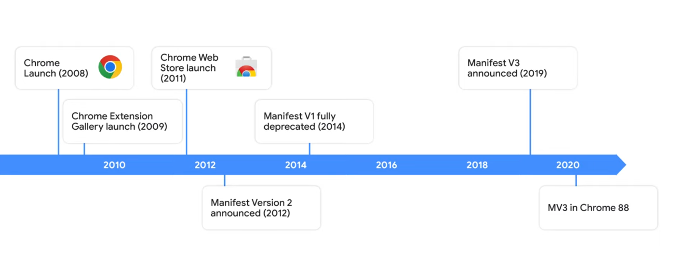
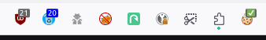
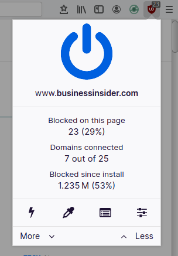
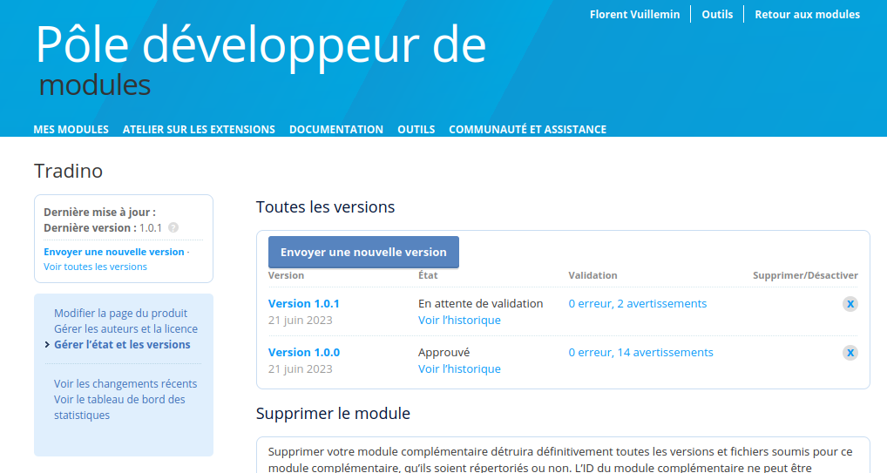
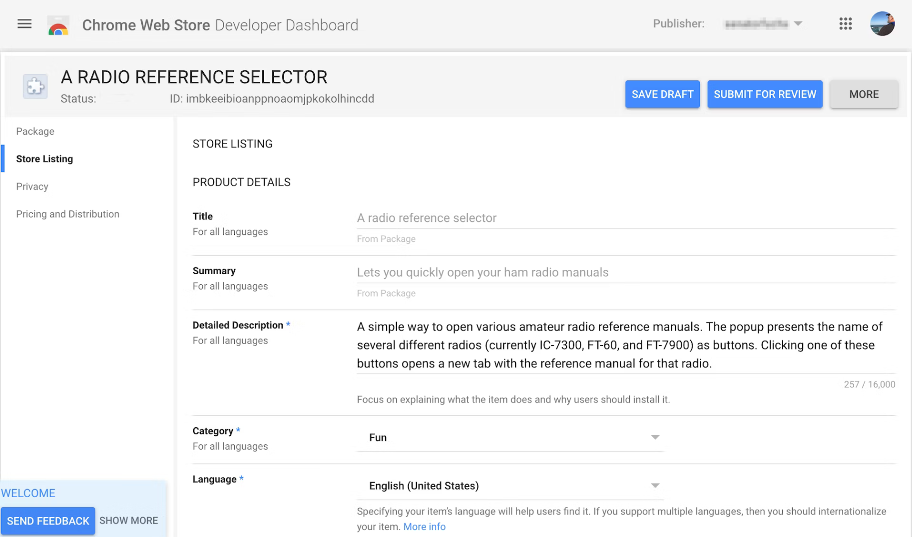
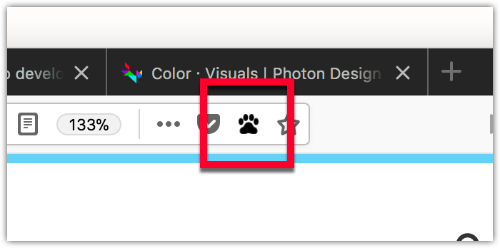
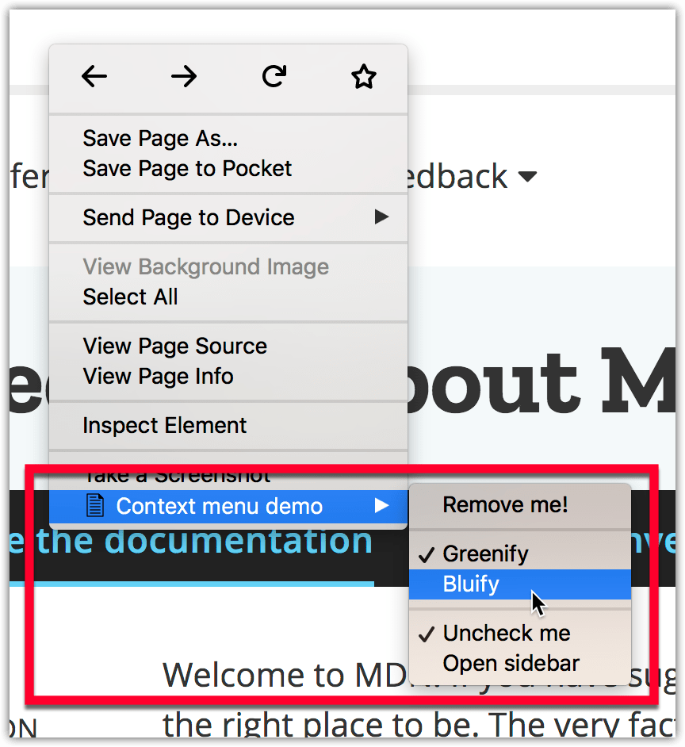
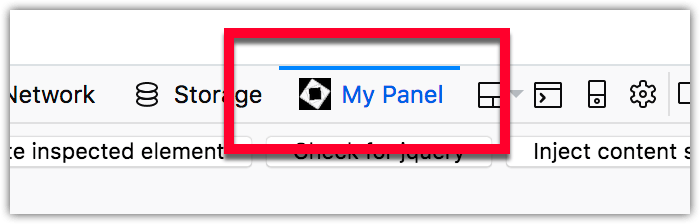
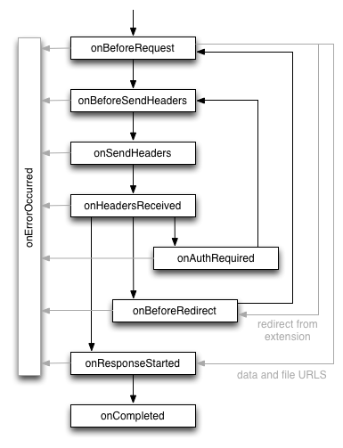

<!-- .slide: data-background="#FFF" class="cover" -->

# Développez votre première extension de navigateur<!-- .element: class="title" -->

## Breizhcamp 2023 <!-- .element: class="title" -->

Aurélien Partiot, Florent Vuillemin <!-- .element: class="author" -->

28/06/2023 <!-- .element: class="date" -->


--

# Aurélien Partiot
## Développeur IA


Javascript, Python, IA, React

Ne supporte pas Elm !

<a href="https://linkedin.com/in/aurelien-partiot-21ab1b111">
	 @aurelien-partiot
</a>

-- 

# Florent Vuillemin
## Développeur d'outils de sécurité


C, Go, Kotlin, Elm (de l'ATmea168 à Openshift)

Traque les sites de phishing à ses heures perdues

<a href="https://mamot.fr/@fvln">
	 @fvln@mamot.fr
</a>

---

# Pourquoi ce talk ?

## L'organisation qu'on vous propose <!-- .element: class="fragment" -->

* Théorie <!-- .element: class="fragment" -->
* Pratique <!-- .element: class="fragment" -->
* Temps de questions <!-- .element: class="fragment" -->


---


<!-- .slide: data-background="#000" class="chapter" -->

# Introduction <!-- .element: class="r-fit-text" -->


--

## Historique des navigateurs

* 1990: **WorldWideWeb** - Premier navigateur
* 1993: **NCSA Mosaic** - Premier navigateur à afficher des images (GIF et XBM)
* 1995: Création d'**Internet Explorer**
* 2000:	**IE** gagne la guerre des navigateurs 😒
* 2003: Création de **Mozilla Firefox**
* 2005: **IE** ⏬ vs **Firefox** ⏫
* 2008: Sortie de **Google Chrome**
* 2012: **Chrome** devient le navigateur le plus utilisé



--

## Développement des extensions

* 2010: Ouverture du **Chrome Web Store**

* 2012: Plus de **750 millions** d'extension sur CWS

* 2017: Les extensions **Firefox** sont désormais largement compatibles avec celles de Chrome

* 2020: Microsoft reconstruit **Edge** avec Chromium

* 2020: Apple sort **Safari 14** qui copie l'API de chrome pour les extensions.

--

## Manifests - la guerre des versions



--

## Manifests - v2 vs v3

|Fonctionnalité			 | v2			| v3			| Impact |
|--------------|---------------|---------------|--------------|
| Exécution de code distant | Autorisé | **Interdit** | Sécurité
| Services en arrière plan | Background pages | **Service workers** | Performance
| WebRequest | Blocking | **Declarative** | Sécurité*

*utilisé par 42% des extensions malveillantes en 2019

Youtube : [What's new in Chrome Extensions, Google/IO 2023](https://io.google/2023/program/ef3f10de-8e4f-43f4-9a04-82d03bbebe06/intl/fr/)

--

# `manifest.json`- la base

```json [2-4|5-9|11-16]
{
	"manifest_version": 3,
	"name": "Borderify",
	"version": "1.0",
	"description": "Adds a solid red border to all webpages matching mozilla.org.",
	"homepage_url": "https://github.com/mdn/webextensions-examples/tree/master/borderify",
	"icons": {
		"48": "icons/border-48.png"
	},

	"content_scripts": [
		{
			"matches": ["*://*.mozilla.org/*"],
			"js": ["borderify.js"]
		}
	]
}
```

--


--


## Et sur mobile ?

### Chrome

Impossible - utiliser Kiwi Browser à la place

### Firefox

> You can install a limited number of extensions from the Recommended Extensions program to add features to Firefox for Android.

* 18 extensions disponibles 🥳

* Possibilité d'[en ajouter d'autres](https://www.androidpolice.com/install-add-on-extension-mozilla-firefox-android/) via le menu Debug de Firefox bêta

### Safari

Désolés, on n'a pas assez de budget pour acheter un iPhone 😓


---


<!-- .slide: data-background="#000" class="chapter" -->

# Let's get started! <!-- .element: class="r-fit-text" -->


--

## Pré-requis

### NodeJS

➡️ https://nodejs.org/en/download

* Windows - MSI ou ZIP
* MacOS
* Linux
* Docker

### Git (facultatif)

Selon votre système d'exploitation

--

## Mise en place

### Récupérer les sources de la formation

```sh
git clone https://github.com/Nuuky/breizhcamp-2023-webextension.git
ou : wget https://github.com/Nuuky/breizhcamp-2023-webextension/archive/refs/heads/main.zip
```


--

### Installer les packages node

```sh
cd breizhcamp-2023-webextension/template
npm install
```

* `parcel` : build/serve HTML/CSS/JS
* `web-ext` : un outil en ligne de commande pour developper des extensions
* `eslint` : un linter JS 

--

## Lancer le build pour Chrome

```sh
# Assembler l'extension dans dist/
npm run build

# Idem avec mise à jour automatique
npm run watch
```


* Charger l'extension non empaquetée
* Sélectionner le dossier `dist/`

--

## Lancer le build pour Firefox

```sh
# Assembler l'extension dans dist/
npm run build:firefox

# Idem avec mise à jour automatique
npm run watch:firefox

# Lance un navigateur déjà outillé qui recharge l'extension
# quand le contenu du dist/ change
npm run dev:firefox
```

Quelques subtilités :
* Parcel ne gère pas le build d'extensions au format MV3 pour Firefox
* Besoin de modifier à la marge le `manifest.json` au moment du build

-- 

# ça marche ?

Alors c'est l'occasion de customiser votre `manifest.json` !

* Nom
* Description
* ID (adresse email ou GUID)

---


<!-- .slide: data-background="#000" class="chapter" -->

# Le content-script <!-- .element: class="r-fit-text" -->


--

## Le content-script

> Un script de contenu (content script en anglais) est une partie de votre extension qui s’exécute dans le contexte d’une page web donnée

* Ce script a accès à tout le DOM, il est idéalement placé pour observer son contenu ou le modifier.

* Il ne voit pas les variables définies par le javascript de la page, ni les bibliothèques chargées (jQuery...).
	* Améliore la sécurité (introduit dès le début de Chrome)
	* Limite les conflits !

* Limitations : 
	* ⛔ le content-script est désactivé sur les domaines sensibles comme https://accounts.firefox.com
	* Il ne permet pas d'accéder à toute l'API WebExtension

-- 

## Le content-script

* Documentation : [  Chrome](https://developer.chrome.com/docs/extensions/mv3/content_scripts/), [  Firefox](https://developer.mozilla.org/fr/docs/Mozilla/Add-ons/WebExtensions/Content_scripts)
* Déclaration dans le manifest :
```json
{
	"content_scripts": 
	[{
		"matches": ["<all_urls>"],
		"js": ["content-script/index.js"]
	}],
}
```

* Permet d'injecter du JS, du CSS
* Sur des sites/pages précises
* Déclaration possible au runtime (demande de permissions à la voléee*)

*sauf si l'utilisateur déclenche l'extension (voir [activeTab](https://developer.chrome.com/docs/extensions/mv3/manifest/activeTab/))


-- 

## Le content-script

### Le rôle de notre extension

> Afficher tous les textes de la page en langage Dino


--

### Mise à jour du manifest

```json
{
	"content_scripts": [
		{
			"matches": ["<all_urls>"],
			"js": ["content-script/index.js"],
			"css": ["content-script/index.css"],

		}
	],
}
```

### Déploiement

|| Chrome | Firefox |
|-|-|-|
| Initialisation | `npm run build` | `npm run build:firefox` |
| Lancement du navigateur | lancer chrome, installer l'extension | `npm run dev:firefox` |
| Après modif du code | `npm run build` et recharger l'extension | `npm run build:firefox` (Rechargement automatique) |

--

### Cible


--

# Live coding <!-- .element: class="r-fit-text" -->

💡 Retrouvez les versions corrigées dans le répertoire `content-script`

---


<!-- .slide: data-background="#000" class="chapter" -->

# Le background-script <!-- .element: class="r-fit-text" -->
# ou service worker

(comme pour le web... mais pas tout à fait)


--

<!-- .slide: class="aurelien" -->

## Le service worker

> Le _service worker_ permet de s'abonner et de réagir à des évènements émis par le navigateur, tels que la navigation vers une nouvelle page, la suppression d'un marque-page ou la fermeture d'un onglet.

* Exécuté dans le contexte de la _background page_, pas dans celui d'une page web.

* Démarré au besoin, déchargé lorsqu'il devient inactif

* Communique :
  * **avec les autres composants** de l'extension par envoi/réception de messages
  * **avec le navigateur** par des appels API et exécution de callbacks

* L'endroit idéal pour aiguiller les messages et effectuer des actions globales à l'extension :
	* télécharger des ressources
	* intercepter des requêtes HTTP

--

## Modification de notre extension

### Transformation des titres en Dinos


--

<!-- .slide: class="florent" -->

## Modification de notre extension

* Documentation : [  Chrome](https://developer.chrome.com/docs/extensions/mv3/service_workers/), [  Firefox](https://developer.mozilla.org/en-US/docs/Mozilla/Add-ons/WebExtensions/Background_scripts)


### content-script

* Le content-script ne stocke plus de ressource

* Il demande au service worker de les lui fournir _via_ échange de messages

* ⚠ L'envoi de message est asynchrone


### service worker

* Le service worker déclare une callback avec `onMessage.addListener()`

* Il répond au service worker lorsque sollicité (~appel RPC)

-- 

## Modification de notre extension


--

# Live coding <!-- .element: class="r-fit-text" -->

💡 Retrouvez la version corrigée dans le répertoire `service-worker`

---


<!-- .slide: data-background="#000" class="chapter" -->

# Popup et browser-action <!-- .element: class="r-fit-text" -->


--

## Browser-action

* Documentation : [  Chrome](https://developer.chrome.com/docs/extensions/reference/browserAction/#popup), [  Firefox](https://developer.mozilla.org/fr/docs/Mozilla/Add-ons/WebExtensions/API/browserAction)



* De belles icônes dans différentes résolutions
	* on peut leur ajouter des tags
	* modifier l'icône à la volée

* Sans configuration supplémentaire, le click sur l'icône déclenche l'envoi d'un évènement `click` au service worker

--

## La popup

<table>
<tbody>
<tr style="background: none;">
<td>

</td>
<td>

* Documentation : [  Chrome](), [  Firefox](https://developer.mozilla.org/en-US/docs/Mozilla/Add-ons/WebExtensions/user_interface/Popups)

```json 
"browser_action": {
  "browser_style": true,
  "default_icon": {
    "16": "button/geo-16.png",
    "32": "button/geo-32.png"
  },
  "default_title": "Whereami?",
  "default_popup": "popup/geo.html",
}
```

* Une page web indépendante (HTML, JS) définie dans le manifest et ouverte uniquement à l'initiative de l'utilisateur (sauf sous Firefox, cf. [`browserAction.openPopup`](https://developer.mozilla.org/en-US/docs/Mozilla/Add-ons/WebExtensions/API/browserAction/openPopup))

* Communique avec le service worker ou le content-script par envoi de messages

* ⚠️ dans le cas général, la popup veut envoyer des messages au content-script de l'onglet actif !

</td>
</tr>
</tbody>
</table>

-- 

## Modification de notre extension


--

## Modification de notre extension


### content-script

* Le content-script n'effectue plus d'action lorsqu'il est chargé

* Il attend un message l'autorisant à déclencher cette action

* ⚠️ L'envoi de message est asynchrone


### service worker

* La popup expose deux boutons cliquables

* Apès un clic, elle envoie un message au content-script pour déclencher le remplacement

* Plus de problème d'autorisation !

---


<!-- .slide: data-background="#000" class="chapter" -->

# Stockage persistent <!-- .element: class="r-fit-text" -->

Pouvoir mémoriser des choses, c'est pratique


--

## Stockage persistent

* Documentation : [  Chrome](https://developer.chrome.com/docs/extensions/reference/storage/), [  Firefox](https://developer.mozilla.org/fr/docs/Mozilla/Add-ons/WebExtensions/API/storage)

* Nécessite la permission `storage` ou `unlimitedStorage` dans le manifest 

* 3 types de stockage :
  * **local** : dans ce navigateur (~5Mo par défaut)
  * **sync** : disponible pour tous les instances synchronisées
  * **managed** : [déployé par l'administrateur du domaine](https://developer.mozilla.org/fr/docs/Mozilla/Add-ons/WebExtensions/API/storage/managed) et accessible en lecture seule par l'extension

* ⚠️ Lecture et écriture sont asynchrones

--

## Modification de notre extension

### Stockage de statistiques

* Enregistrer le nombre d'actions faites par notre extension dans chaque page depuis le content-script

* Afficher ces statistiques dans la popup

```js
chrome.storage.local.set({ key: value }).then(() => {
  console.log("Value is set");
});
```

--

## Modification de notre extension


--- 


<!-- .slide: data-background="#000" class="chapter" -->

# Page de configuration <!-- .element: class="r-fit-text" -->

En Anglais _options page_


--

## Options page


* Documentation : [  Chrome](https://developer.chrome.com/docs/extensions/mv3/options/), [  Firefox](https://developer.mozilla.org/en-US/docs/Mozilla/Add-ons/WebExtensions/user_interface/Options_pages)

* Une page web indépendante (HTML, JS) définie dans le manifest et ouverte :
  * _via_ l'interface du navigateur
  * par un appel à `runtime.openOptionsPage()`

* Utilisation typique : lire/écrire des données de configuration dans le local storage
  * Exemple uBlock origin : sélection des listes de blocage

* ⚠️ Cette page n'est pas affichée dans un onglet "traditionnel" du navigateur

--

## Modification de notre extension

* Ajouter une page de configuration qui permet de configurer les balises dans lesquelles on effectue les remplacements

* Ces balises sont enregistrées dans le local storage

* Créer un raccourci permettant d'ouvrir cette page depuis la popup de l'extension

-- 

## Modification de notre extension


---


<!-- .slide: data-background="#000" class="chapter" -->

# Signature et distribution <!-- .element: class="r-fit-text" -->


--

##  Firefox

* Créer un compte sur le [pôle développeurs de modules](https://addons.mozilla.org/fr/developers/)
* Proposer un nouveau module
* Choisir la publication :
  - sur https://addons.mozilla.org
  - en auto-distribution (voir la clé [`update_url`](https://extensionworkshop.com/documentation/manage/updating-your-extension/))
* Packer l'extension et envoyer le fichier `.xpi` puis...

-- 

* Attendre la signature par Mozilla



--

##  Chrome, edge

* Créer un compte sur le [Chrome Web Store](https://developer.chrome.com/docs/webstore/register/)
* Proposer un nouveau module sur le [Chrome Developer Dashboard](https://chrome.google.com/webstore/devconsole)
* Packer l'extension et envoyer le fichier `.zip`
* Choisir la visibilité sur le store :
  - publique
  - non listée
  - privée (nécessite ajout des emails des utilisateurs)

--




---


<!-- .slide: data-background="#000" class="chapter" -->

# Ce que nous n'avons pas vu <!-- .element: class="r-fit-text" -->


--

## Le bouton _page action_



* Documentation : [  Chrome](https://developer.chrome.com/docs/extensions/reference/pageAction/), [  Firefox](https://developer.mozilla.org/en-US/docs/Mozilla/Add-ons/WebExtensions/user_interface/Page_actions)


* Similaire à l'action button, mais dédié aux actions qui ne s'appliquent qu'à certaines pages

* Exemple : afficher le flux RSS

--

## Content menu



* Documentation : [  Chrome](https://developer.chrome.com/docs/extensions/reference/contextMenus/), [  Firefox](https://developer.mozilla.org/en-US/docs/Mozilla/Add-ons/WebExtensions/user_interface/Context_menu_items)

* Nécessite la permission `contextMenu`

-- 

## Devtools




* Documentation : [  Chrome](https://developer.chrome.com/docs/extensions/mv3/devtools/), [  Firefox](https://developer.mozilla.org/en-US/docs/Mozilla/Add-ons/WebExtensions/user_interface/devtools_panels)

-- 

## Interception de requêtes HTTP

<table>
<tbody>
<tr style="background: none;">
<td>

</td>
<td>


* Documentation : [  Chrome](https://developer.chrome.com/docs/extensions/reference/webRequest/), [  Firefox](https://developer.mozilla.org/en-US/docs/Mozilla/Add-ons/WebExtensions/Intercept_HTTP_requests)

* Nécessite la permission `webRequest`

* Puissantes capacités d'interception, blocage ou modification à la volée des échanges

* La permission `webRequestBlocking`, massivement utilisée par les adblocks :
  * n'est plus autorisée en MV3 sur Chrome
  * reste supportée en MV2 et MV3 par Firefox

</td>
</tr>
</tbody>
</table>

-- 

## Testes

* Testes unitaires: JEST.
* Testes E2E: Possibilité d'intégrer l'extension directement dans puppeteer.


```js
const puppeteer = require('puppeteer'); // import Puppeteer
const path = require('path');

// Path to the actual extension we want to be testing
const pathToExtension = path.join(
  path.join(__dirname, '..', '..', '..', '..', 'dist')
);

// Tell puppeteer we want to load the web extension
const puppeteerArgs = [
  `--disable-extensions-except=${pathToExtension}`,
  `--load-extension=${pathToExtension}`,
  '--show-component-extension-options',
];
```