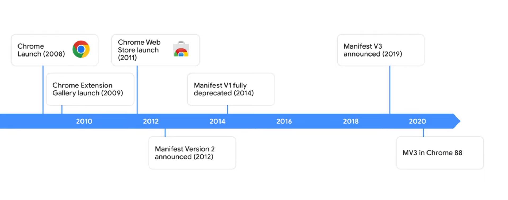
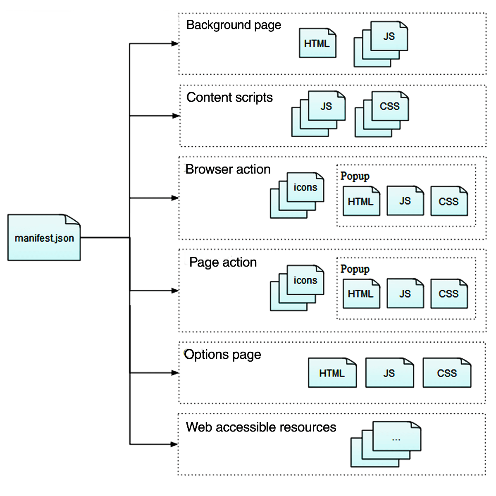
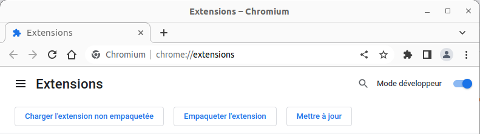
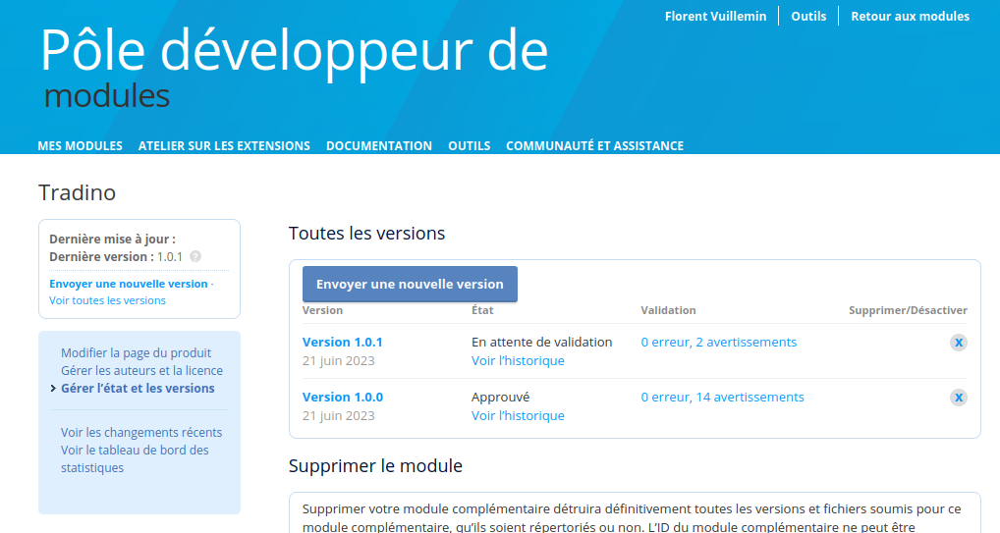
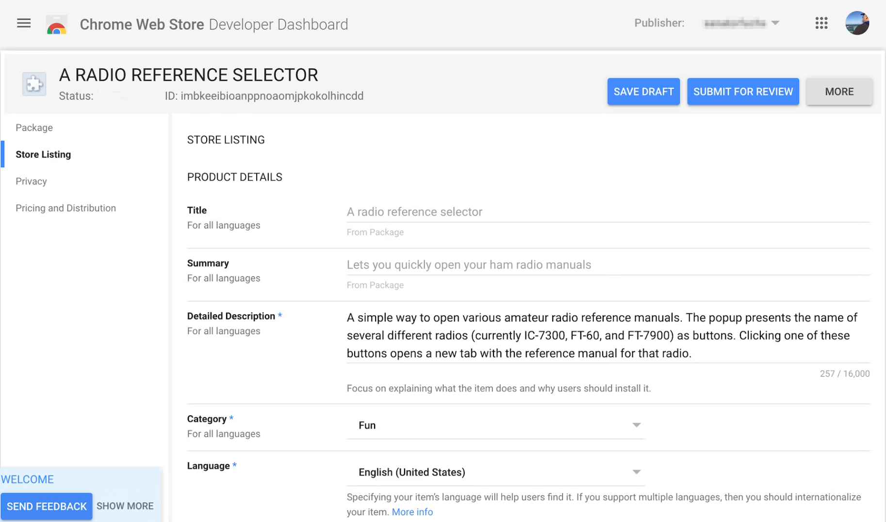
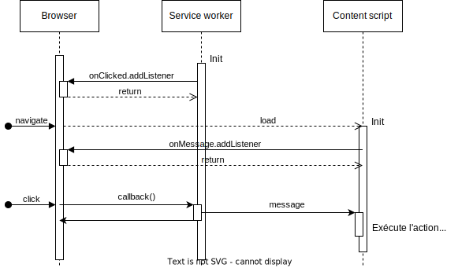
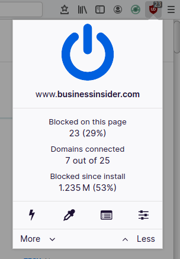

<!-- .slide: data-background="#FFF" class="cover" -->

# Développez votre première extension de naigateur<!-- .element: class="title" -->

## Breizhcamp 2023 <!-- .element: class="title" -->

Aurélien Partiot, Florent Vuillemin <!-- .element: class="author" -->

28/06/2023 <!-- .element: class="date" -->


--

# Aurélien Partiot
## Développeur IA


* 
* 
* 

-- 

# Florent Vuillemin
## Développeur d'outils de sécurité


C, Go, Kotlin, Elm (de l'ATmea168 à Openshift)

Traque les sites de phishing à ses heures perdues

<a href="https://mamot.fr/@fvln">
	 @fvln@mamot.fr
</a>

---

<!-- .slide: class="plan" data-background="./images/paper-board_o10.png" -->

# Plan

1. Introduction et mise en place
2. Le content-script
3. Menu contextuel
4. Background script
5. Browser action (icône)

---


<!-- .slide: data-background="#000" class="chapter" -->

# Introduction <!-- .element: class="r-fit-text" -->


--

## Historique des navigateurs

* 1990: **WorldWideWeb** - Premier navigateur

* 1993: **NCSA Mosaic** - Premier navigateur à afficher des images (GIF et XBM)

* 1995: Création d'**Internet Exploreur**

* 2000:	**IE** gagne la guerre des navigateurs 😒

* 2003: Création de **Mozilla Firefox**

* 2005: **IE** ⏬ vs **Firefox** ⏫

* 2008: Sortie de **Google Chrome**

* 2012: **Chrome** devient le navigateur le plus utilisé

--

## Développement des extensions

* 2010: Ouverture du **Chrome Web Store**

* 2012: Plus de **750 millions** d'extension sur CWS

* 2017: Les extensions **Firefox** sont désormais largement compatibles avec celles de Chrome

* 2020: Microsoft reconstruit **Edge** avec Chromium

* 2020: Apple sort **Safari 14** qui copie l'API de chrome pour les extensions.

--

## Manifests - la guerre des versions



--

## Manifests - v2 vs v3

|Feature			 | v2			| v3			| Impact |
|--------------|---------------|---------------|--------------|
| Exécution de code distant | Autorisé | Interdit | Sécurité
| Services en arrière plan | Background pages | Service workers | Performance
| WebRequest | Blocking | Declarative | Sécurité*

*utilisé par 42% des extensions malveillantes en 2019

Youtube : [What's new in Chrome Extensions, Google/IO 2023](https://io.google/2023/program/ef3f10de-8e4f-43f4-9a04-82d03bbebe06/intl/fr/)

--

# `manifest.json`- la base

```json [2-4|5-9|11-16]
{
	"manifest_version": 2,
	"name": "Borderify",
	"version": "1.0",
	"description": "Adds a solid red border to all webpages matching mozilla.org.",
	"homepage_url": "https://github.com/mdn/webextensions-examples/tree/master/borderify",
	"icons": {
		"48": "icons/border-48.png"
	},

	"content_scripts": [
		{
			"matches": ["*://*.mozilla.org/*"],
			"js": ["borderify.js"]
		}
	]
}
```

--



--


## Et sur mobile ?

### Chrome

Impossible - utiliser Kiwi Browser à la place

### Firefox

> You can install a limited number of extensions from the Recommended Extensions program to add features to Firefox for Android.

* 18 extensions disponibles

* Possibilité d'[en ajouter d'autres](https://www.androidpolice.com/install-add-on-extension-mozilla-firefox-android/) via le menu Debug de Firefox bêta

---


<!-- .slide: data-background="#000" class="chapter" -->

# Let's get started! <!-- .element: class="r-fit-text" -->


--

## Pré-requis

### NodeJS

➡️ https://nodejs.org/en/download

* Windows - MSI ou ZIP
* MacOS
* Linux
* Docker

### Git

Selon votre système d'exploitation

--

## Mise en place

### Récupérer les sources de la formation

```sh
git clone https://github.com/Nuuky/breizhcamp-2023-webextension.git
ou : wget https://github.com/Nuuky/breizhcamp-2023-webextension/archive/refs/heads/main.zip
```


--

### Installer les packages node

```sh
cd breizhcamp-2023-webextension/0-template
npm install
```

* `parcel` : build/serve HTML/CSS/JS
* `web-ext` : un outil en ligne de commande pour developper des extensions
* `eslint` : un linter JS 

--

## Lancer le build pour Chrome

```sh
# Assembler l'extension dans dist/
npm run build

# Idem avec mise à jour automatique
npm run watch
```


* Charger l'extension non empaquetée
* Sélectionner le dossier `dist/`

--

## Lancer le build pour Firefox

```sh
# Assembler l'extension dans dist/
npm run build:firefox

# Idem avec mise à jour automatique
npm run watch:firefox

# Lance un navigateur déjà outillé
npm run dev:firefox
```

Quelques subtilités :
* Parcel ne gère par le build d'extensions au format MV3 pour Firefox
* Besoin de modifier à la marge le `manifest.json` au moment du build

-- 

# ça marche ?

Alors c'est l'occasion de customiser votre `manifest.json` !

---


<!-- .slide: data-background="#000" class="chapter" -->

# Le content-script <!-- .element: class="r-fit-text" -->


--

## Le content-script

> Un script de contenu (content script en anglais) est une partie de votre extension qui s’exécute dans le contexte d’une page web donnée

* Ce script a accès à tout le DOM, il est idéalement placé pour observer son contenu ou le modifier.

* Il ne voit pas les variables définies par le javascript de la page, ni les bibliothèques chargées (jQuery...).
	* Améliore la sécurité (introduit dès le début de Chrome)
	* Limite les conflits !

* Limitations : 
	* ⛔ le content-script est désactivé sur les domaines sensibles comme https://accounts.firefox.com
	* Il ne permet pas d'accéder à toute l'API WebExtension

-- 

## Le content-script

* Documentation : [  Chrome](https://developer.chrome.com/docs/extensions/mv3/content_scripts/), [  Firefox](https://developer.mozilla.org/fr/docs/Mozilla/Add-ons/WebExtensions/Content_scripts)
* Déclaration dans le manifest :
```json
{
	"content_scripts": 
	[{
		"matches": ["<all_urls>"],
		"js": ["content-script/index.js"]
	}],
}
```

* Permet d'injecter du JS, du CSS
* Sur des sites/pages précises
* Déclaration possible au runtime (demande de permissions à la volée*)

*ou pas (voir [activeTab](https://developer.chrome.com/docs/extensions/mv3/manifest/activeTab/))


-- 

# Le content-script

## Votre premier choix

| DinoFacts | PoliDino | Tradino |
|-|-|-|
| Ajoute des anecdotes amusantes concernant les dinosaures sur chaque page |  Remplace les noms des personnes politiques par des noms de dinosaures, une idée inspirée de  [Proutify](https://addons.mozilla.org/fr/firefox/addon/proutify/) | Affiche tous les textes de la page en langage Dino et remplace les titres par des paroles de [Dinos](https://fr.wikipedia.org/wiki/Dinos_(rappeur)) |
| Injection de CSS | Remplacement sur le domaine liberation.fr | Choc culturel |

**Remarque :** Ces deux extensions fonctionnent sans exploiter les API du navigateur.

--

### Mise à jour du manifest

```json
{
	"content_scripts": [
		{
			"matches": ["<all_urls>"],
			"js": ["content-script/index.js"],
			"css": ["content-script/index.css"],

		}
	],
}
```

### Déploiement

|| Chrome | Firefox |
|-|-|-|
| Initialisation | npm run watch | npm run watch:firefox |
| Lancement du navigateur | lancer chrome, installer l'extension | npm run dev:firefox |
| Après modif du code | Recharger l'extension | Rechargement automatique |

--

# Live coding <!-- .element: class="r-fit-text" -->

💡 Retrouvez les versions corrigées dans le répertoire `content-script`

--

## Signature et distribution

###  Firefox

* Créer un compte sur le [pôle développeurs de modules](https://addons.mozilla.org/fr/developers/)
* Proposer un nouveau module
* Choisir la publication :
  - sur https://addons.mozilla.org
  - en auto-distribution (voir la clé [`update_url`](https://extensionworkshop.com/documentation/manage/updating-your-extension/))
* Packer l'extension et envoyer le fichier `.xpi` puis...

-- 

* Attendre la signature par Mozilla



--

###  Chrome, edge

* Créer un compte sur le [Chrome Web Store](https://developer.chrome.com/docs/webstore/register/)
* Proposer un nouveau module sur le [Chrome Developer Dashboard](https://chrome.google.com/webstore/devconsole)
* Packer l'extension et envoyer le fichier `.zip`
* Choisir la visibilité sur le store :
  - publique
  - non listée
  - privée (nécessite ajout des emails des utilisateurs)

--



---


<!-- .slide: data-background="#000" class="chapter" -->

# Le background-script <!-- .element: class="r-fit-text" -->
# ou service worker

(comme pour le web... mais pas tout à fait)


--

<!-- .slide: class="aurelien" -->

## Le service worker

> Le _service worker_ permet de s'abonner et de réagir à des évènements émis par le navigateur, tels que la navigation vers une nouvelle page, la suppression d'un marque-page ou la fermeture d'un onglet.

* Exécuté dans le contexte de la _background page_, pas dans celui d'une page web.

* Démarré au besoin, déchargé lorsqu'il devient inactif

* Communique :
  * **avec les autres composants** de l'extension par envoi/réception de messages
  * **avec le navigateur** par des appels API et exécution de callbacks

* L'endroit idéal pour aiguiller les messages et effectuer des actions globales à l'extension :
	* télécharger des ressources
	* intercepter des requêtes HTTP

--

<!-- .slide: class="florent" -->

## Modification de notre extension

* Documentation : [  Chrome](https://developer.chrome.com/docs/extensions/mv3/service_workers/), [  Firefox](https://developer.mozilla.org/en-US/docs/Mozilla/Add-ons/WebExtensions/Background_scripts)

### content-script

* Le content-script n'effectue plus d'action lorsqu'il est chargé

* Il attend un message l'autorisant à déclencher cette action

* ⚠ L'envoi de message est asynchrone


### service worker

* Le service worker s'abonne à l'évènement `clic sur l'icône de l'extension`

* Apès un clic, il envoie un message au content-script pour le réveiller

* Plus de problème d'autorisation !

-- 

## Modification de notre extension



--

# Live coding <!-- .element: class="r-fit-text" -->

---


<!-- .slide: data-background="#000" class="chapter" -->

# Stockage persistent <!-- .element: class="r-fit-text" -->

Pouvoir mémoriser des choses, c'est pratique


--

## Stockage persistent

* Documentation : [  Chrome](https://developer.chrome.com/docs/extensions/reference/storage/), [  Firefox](https://developer.mozilla.org/fr/docs/Mozilla/Add-ons/WebExtensions/API/storage)

* Nécessite la permission `storage` ou `unlimitedStorage` dans le manifest 

* 3 types de stockage :
  * **local** : dans ce navigateur (~5Mo par défaut)
  * **sync** : disponible pour tous les instances synchronisées
  * **managed** : [déployé par l'administrateur du domaine](https://developer.mozilla.org/fr/docs/Mozilla/Add-ons/WebExtensions/API/storage/managed) et accessible en lecture seule par l'extension

* ⚠ Lecture et écriture sont asynchrones

--

## Modification de notre extension

### Stockage de statistiques

* Enregistrer le nombre d'actions faites par notre extension

* Depuis le background-script et le content-script

* Objectif à terme : pouvoir restituer ces statistiques à l'utilisateur

```js
chrome.storage.local.set({ key: value }).then(() => {
  console.log("Value is set");
});
```

---


<!-- .slide: data-background="#000" class="chapter" -->

# Une popup  <!-- .element: class="r-fit-text" -->


--

## Une popup

<table>
<tbody>
<tr style="background: none;">
<td>

</td>
<td>

* Documentation : [  Chrome](https://developer.chrome.com/docs/extensions/reference/browserAction/), [  Firefox](https://developer.mozilla.org/en-US/docs/Mozilla/Add-ons/WebExtensions/user_interface/Popups)

* De belles icônes dans différentes résolutions
	* on peut leur ajouter des tags
	* modifier l'icône à la volée

* Une page web indépendante (HTML, JS) définie dans le manifest et ouverte uniquement à l'initiative de l'utilisateur

* Communique avec le service worker ou le content-script par envoi de messages

</td>
</tr>
</tbody>
</table>

--

## Modification de notre extension


-- 


<!-- .slide: data-background="#000" class="chapter" -->

# Page de configuration <!-- .element: class="r-fit-text" -->

En Anglais _options page_


--

## Options page


* Documentation : [  Chrome](https://developer.chrome.com/docs/extensions/mv3/options/), [  Firefox](https://developer.mozilla.org/en-US/docs/Mozilla/Add-ons/WebExtensions/user_interface/Options_pages)

* Une page web indépendante (HTML, JS) définie dans le manifest et ouverte :
  * _via_ l'interface du navigateur
  * par un appel à `runtime.openOptionsPage()`

* Utilisation typique : lire/écrire des données de configuration dans le local storage
  * Exemple uBlock origin : sélection des listes de blocage

* ⚠ Cette page n'est pas affichée dans un onglet "traditionnel" du navigateur

--

## Modification de notre extension

* Ajouter une page de configuration qui affiche les statistiques de notre extension, depuis son installation.

* Créer un raccourci permettant d'ouvrir cette page depuis la popup de l'extension


-- 


---

<!-- .slide: data-background="#000" class="chapter" -->

# Ce que nous n'avons pas vu <!-- .element: class="r-fit-text" -->


--

## Le bouton _page action_


* Documentation : [  Chrome](https://developer.chrome.com/docs/extensions/reference/pageAction/), [  Firefox](https://developer.mozilla.org/en-US/docs/Mozilla/Add-ons/WebExtensions/user_interface/Page_actions)


* Similaire à l'action button, mais dédié aux actions qui ne s'appliquent qu'à certaines pages

* Exemple : afficher le flux RSS

--

## Content menu


* Documentation : [  Chrome](https://developer.chrome.com/docs/extensions/reference/contextMenus/), [  Firefox](https://developer.mozilla.org/en-US/docs/Mozilla/Add-ons/WebExtensions/user_interface/Context_menu_items)

* Nécessite la permission `contextMenu`

-- 

## Devtools


* Documentation : [  Chrome](https://developer.chrome.com/docs/extensions/mv3/devtools/), [  Firefox](https://developer.mozilla.org/en-US/docs/Mozilla/Add-ons/WebExtensions/user_interface/devtools_panels)

-- 

## Interception de requêtes HTTP

<table>
<tbody>
<tr style="background: none;">
<td>

</td>
<td>


* Documentation : [  Chrome](https://developer.chrome.com/docs/extensions/reference/webRequest/), [  Firefox](https://developer.mozilla.org/en-US/docs/Mozilla/Add-ons/WebExtensions/Intercept_HTTP_requests)

* Nécessite la permission `webRequest`

* Puissantes capacités d'interception, blocage ou modification à la volée des échanges

* La permission `webRequestBlocking`, massivement utilisée par les adblocks :
  * n'est plus autorisée en MV3 sur Chrome
  * reste supportée en MV2 et MV3 par Firefox

</td>
</tr>
</tbody>
</table>

-- 